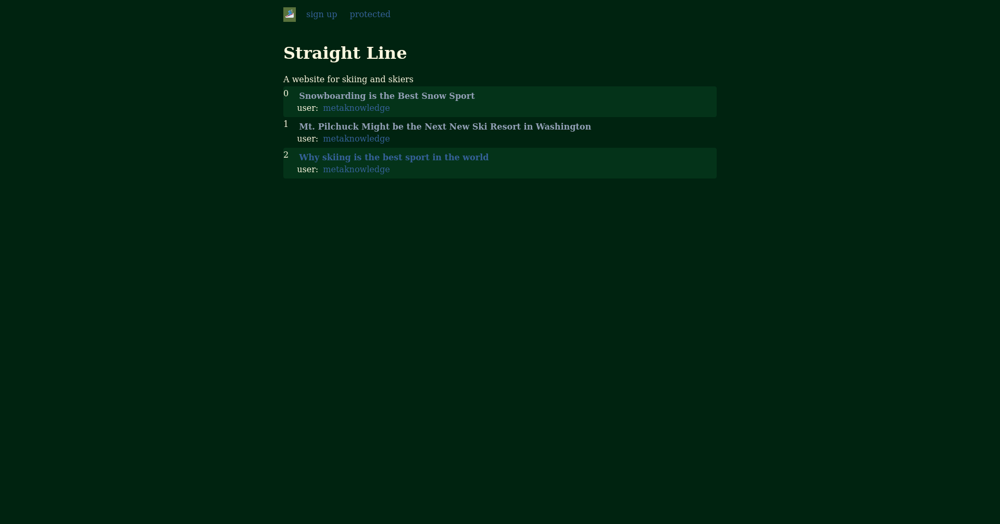

# Lobste.rs Clone

I wanted to use Rust and postgres to create a forum app in the summer of 2024.

## Stack
 - Sqlx + postgres
 - poem-openapi
 - askama
 - htmx
 
 Postgres holds all the user information. Poem is the backend for serving html, while askama is a templating framework rendering simple html templates. The html template + htmx is just a great pair for making web apps. No need for javascript frameworks. 

